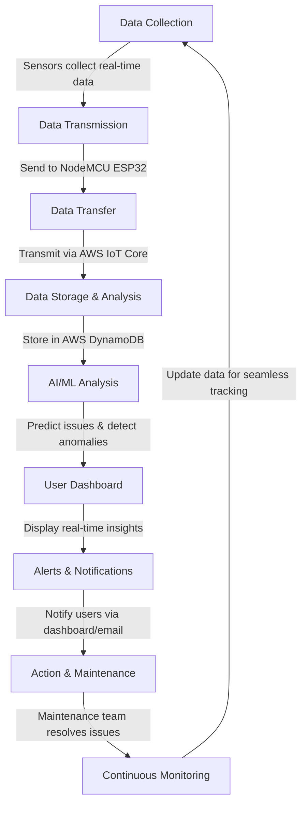
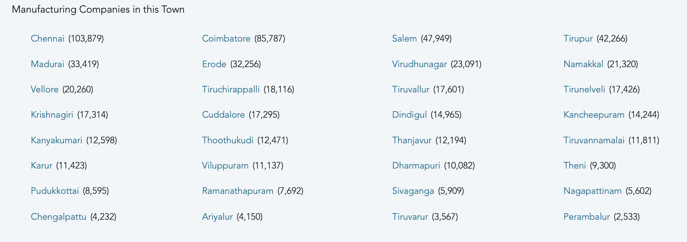
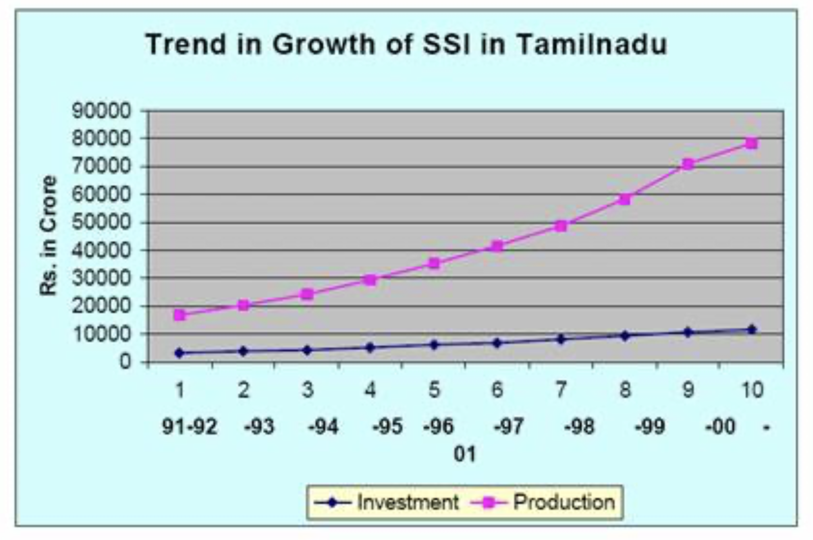
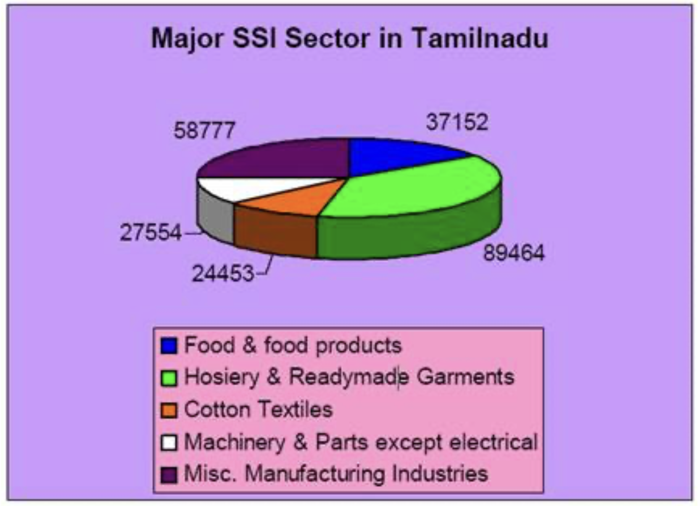

# **Smart Maintain X: Predictive Maintenance for Industry Automation**

## **Project Team**

| Name            | Department         |
|----------------|-------------------|
| Sri Sabari Doss R | Cybersecurity - I |
| Sreejesh S     | Cybersecurity - I |
| Naren A        | AIDS - I          |

---

## **Abstract**

Smart Maintain X is an innovative solution designed to minimize machine downtime and maintenance costs in industries. By embedding IoT sensors for vibration, temperature, pressure, and current monitoring, the system detects abnormal functionalities and provides real-time alerts. 

The collected data is processed using software algorithms to predict failures and optimize maintenance schedules, enhancing reliability and reducing unexpected breakdowns.

---

## **Introduction**

Unplanned breakdowns and inefficient maintenance schedules severely impact industrial operations. Traditional maintenance methods often result in unnecessary downtime and costly repairs.

Our Predictive Smart Maintenance System addresses these challenges by integrating **IoT sensors** and **AI-driven analytics** to monitor equipment in real-time. The system analyzes parameters like **temperature, vibration, and pressure**, utilizing **machine learning** to predict failures before they occur. This proactive approach ensures **minimal downtime** and extends equipment lifespan.

By transitioning from reactive to predictive maintenance, the system significantly enhances **operational efficiency, reduces costs, and improves reliability**.

---

## **Problems Faced by Companies**

- Inefficient **resource management**
- **Worker safety risks** due to undetected issues
- **Inconsistent product quality**
- **High maintenance costs** and unexpected downtime
- Manual data tracking, which is **time-consuming and prone to errors**

---

## **Proposed Solution**

Our proposed **Smart Maintain X** system integrates **smart sensors and software** to provide real-time data and feedback. The system offers:

- **Continuous monitoring** to detect issues before failures occur
- **Automated tracking** of machine performance
- **Optimized maintenance schedules** to reduce downtime
- **Reduced dependence on manual checks**, improving efficiency

---

## **System Specifications**

### **Hardware Requirements**

| Component            | Specification                     |
|---------------------|---------------------------------|
| **Vibration Sensor** | SW-420                          |
| **Temperature Sensor** | DHT22                          |
| **Speed Sensor**    | Tachometer Sensor               |
| **Processing Unit** | NodeMCU (ESP8266/ESP32)        |
| **Power Supply**    | Rechargeable Li-ion (5V, 2500mAh) |
| **Connectivity**    | Wi-Fi (built-in ESP32)         |
| **Display**        | OLED for local monitoring       |
| **Relay Module**   | For controlling industrial equipment |

### **Software Requirements**

| Component                 | Technology Used                     |
|---------------------------|-----------------------------------|
| **Programming Language**  | Embedded C                        |
| **Cloud Platform**        | AWS IoT Core                      |
| **Database**              | Amazon DynamoDB (NoSQL)           |
| **Frontend**              | React.js                           |
| **Backend**               | Node.js with Express.js           |
| **Data Protocol**         | HTTP                               |
| **AI/ML Integration**     | GenAI Models on AWS SageMaker     |

---

## **Workflow**

---
## **Impact and Benefits**

### **Benefits:**
- **Reduced Downtime** – Machines stay operational longer.
- **Cost Savings** – Lowers maintenance and repair costs.
- **Improved Efficiency** – Automates monitoring and reduces errors.
- **Real-time Monitoring** – Provides instant updates on machine health.
- **Small & Large Industries** – Works for all scales of businesses.
- **Compatible with Existing Systems** – Easily integrates with current equipment.

### **Additional Impact:**
- **Increases worker safety** by identifying risks early.
- **Prevents unexpected failures**, ensuring smooth operations.
- **Improves decision-making** with accurate machine insights.
- **Supports sustainable operations** by reducing waste and inefficiencies.

---

## **Budget Estimation**

| Category          | Estimated Cost |
|------------------|---------------|
| **Hardware**     | ₹6,000 - ₹7,000 |
| **Supporting Materials** | ₹1,000        |
| **Total Budget** | ₹8,000         |

---

# Predictive Maintenance for Industry Automation  

## ▬▬▬▬▬▬ Case Study ▬▬▬▬▬▬  

### Growth of Small-Scale Industries  
- The number of **Small-Scale Industries (SSI)** in Tamil Nadu has grown significantly.  
- From **18,440 units in 1977** to **3,87,597 units in 2001**, showcasing a **massive expansion**.  

### Total Manufacturing Industries in Tamil Nadu  
- Tamil Nadu has a strong **manufacturing base** across multiple sectors.  
- A detailed breakdown of **total number of industries** is provided below.  

****  

### Industry Distribution in Tamil Nadu  
- **Top industries by share:**  
  - **Hosiery & Readymade Garments:** **22.2%** (89,464 units)  
  - **Other Manufacturing:** **15%** (58,777 units)  
  - **Food Products:** **10%** (37,152 units)  
  - **Others:** Share in **single digits**  

****  

## ▬▬▬▬▬▬ Key Insights ▬▬▬▬▬▬  

### Competitor Analysis  
- **Competitors are not focusing on small-scale industries**  
- **No automation solutions for worker safety**  

### Research & Development  
- **Predictive maintenance** helps **reduce downtime & enhance efficiency**  
- **AI-driven failure detection** for cost savings  

## ▬▬▬▬▬▬ Project Focus ▬▬▬▬▬▬  

### Predictive Maintenance for Industrial Automation  
**Objective:** Prevent **unexpected machine failures** and **increase efficiency**  

### Why Target Small-Scale Industries?  
- **High number of units**  
- **Lack of existing automation solutions**  
- **High impact on productivity and safety**  

---

## **Conclusion**

The **Smart Maintain X** system transforms industrial maintenance by leveraging **IoT, AI, and predictive analytics**. By reducing downtime, optimizing efficiency, and improving reliability, this solution revolutionizes maintenance practices and enhances productivity across industries.

---

